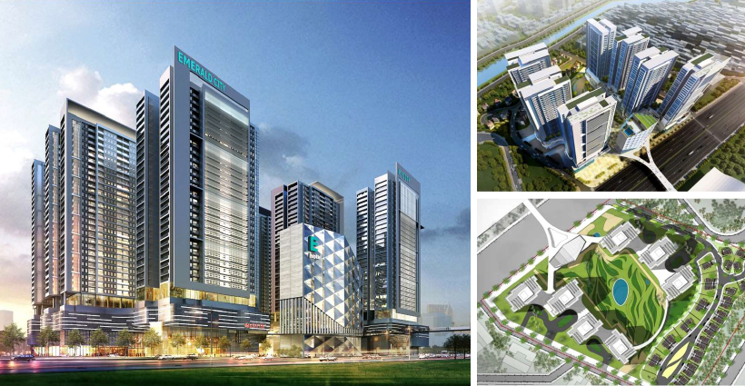
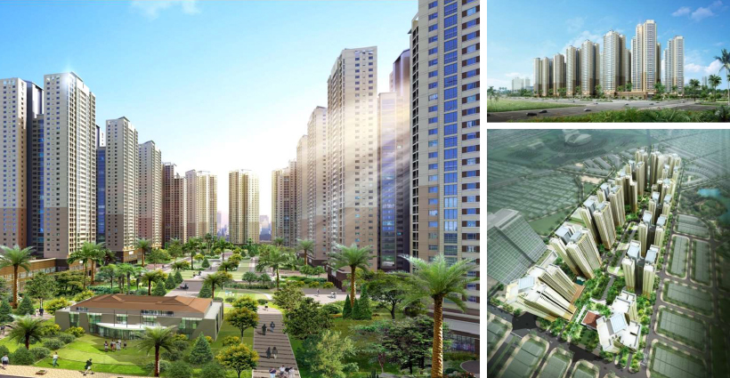

<html>
<head>
<meta charset="UTF-8">
<link rel="stylesheet" href="css.css">
</head>
<body>

  <!-- Full-width images with number and caption text -->
  

    
1 / 4

    
    
U-Silk City: Residence, Commercial, Complex Concept & Basic Design Phase Full Design

  

  

    
2 / 4

    
    
Emerald City Phu Dien (E - city): Residence, Commercial, Health Complex, Parking

  

  

    
3 / 4

    
    
Caption Three

  

  
  

    
2 / 4

    
    
Cleve Van Phu Residence: Residence, Commercial, Green park 

  

  <!-- Next and previous buttons -->
  <a class="prev" onclick="plusSlides(-1)">&#10094;</a>
  <a class="next" onclick="plusSlides(1)">&#10095;</a>

 

<!-- The dots/circles -->

  </body>
 

</html>

